# jellyfin_streaming_clone_app

A Jellyfin clone Flutter project.

## Getting Started

This project is the streaming client app from the custom server for media purpose

## Screen Shots

A few screenshot of the app

### Login Screen

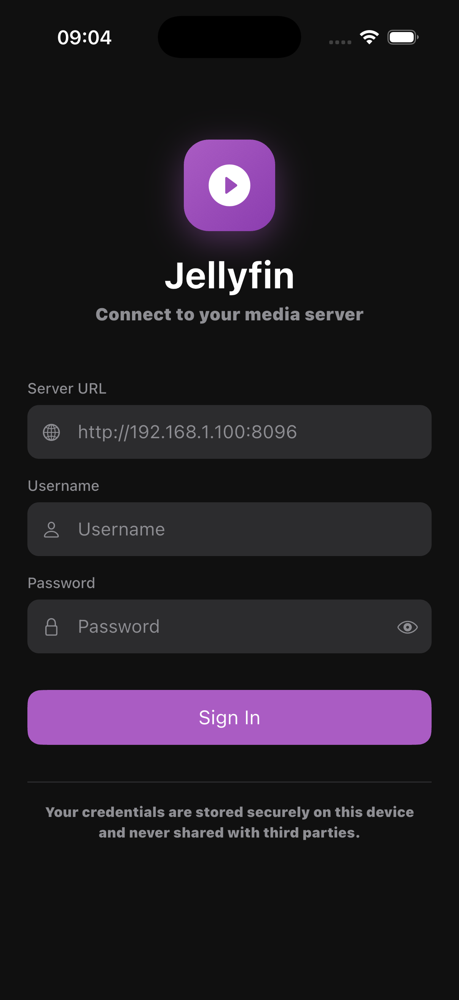

### Main Menu

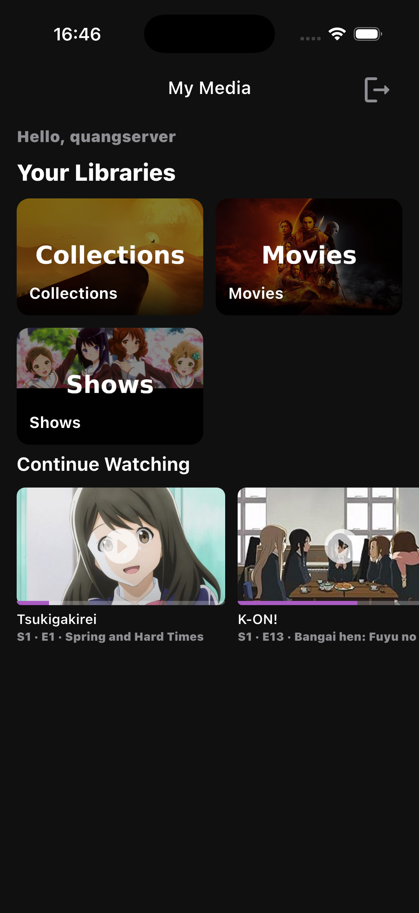

### Movie List Screen

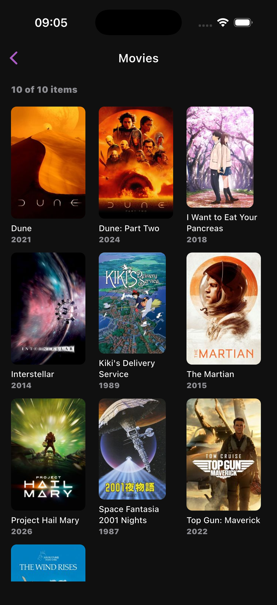

### Movie Detail Screen

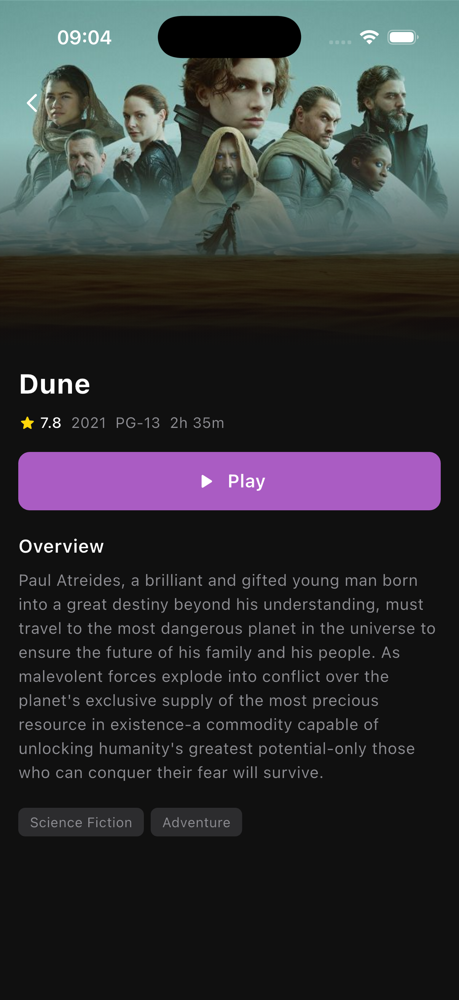

### Shows List Screen

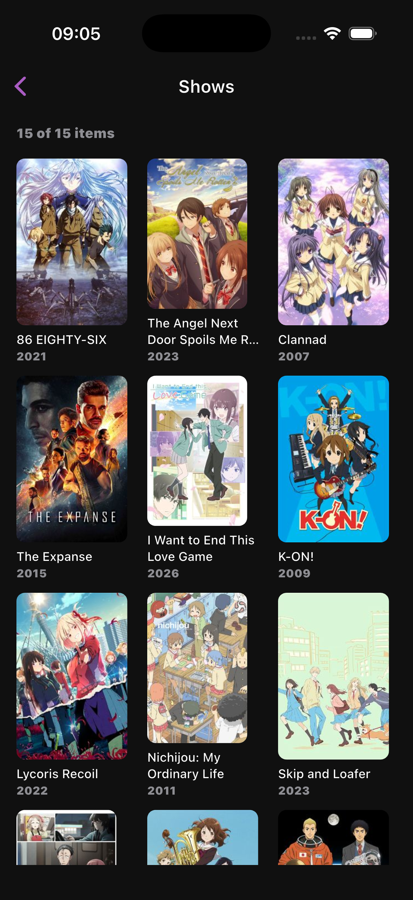

### Shows Detail Screen

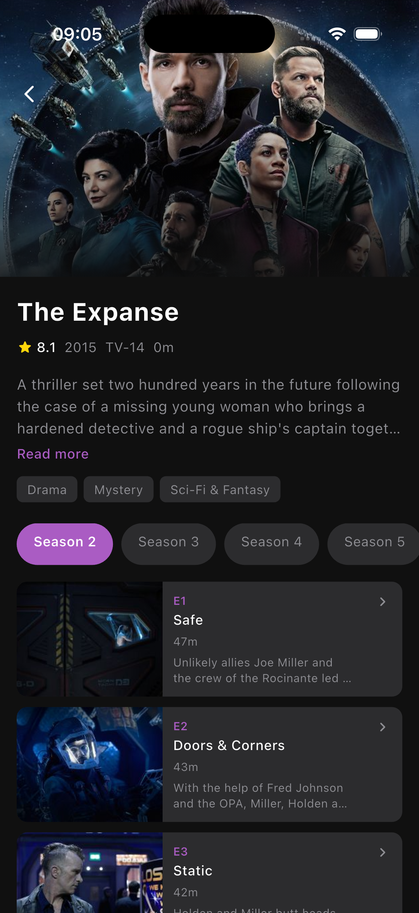

### Episode Detail Screen

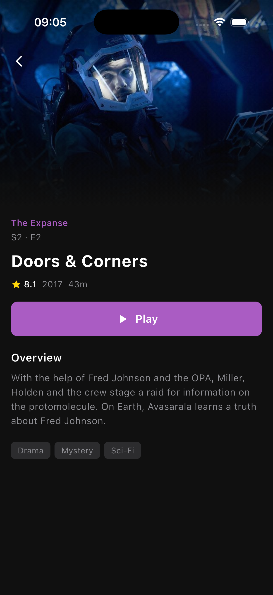

### Player Main Screen

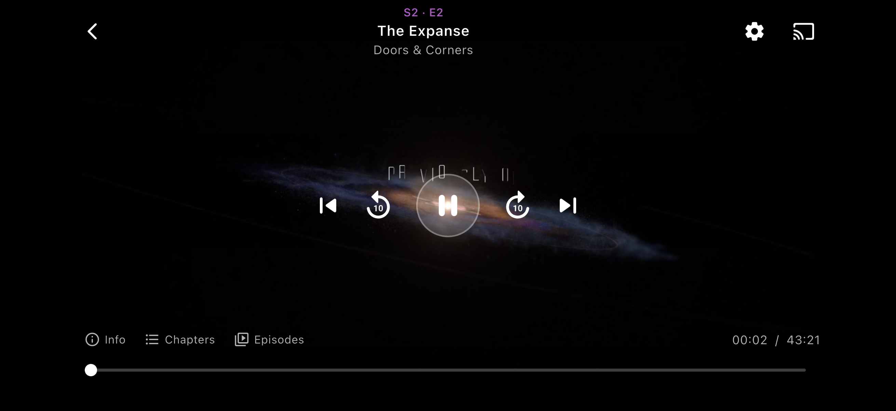

### Settings Audio Select

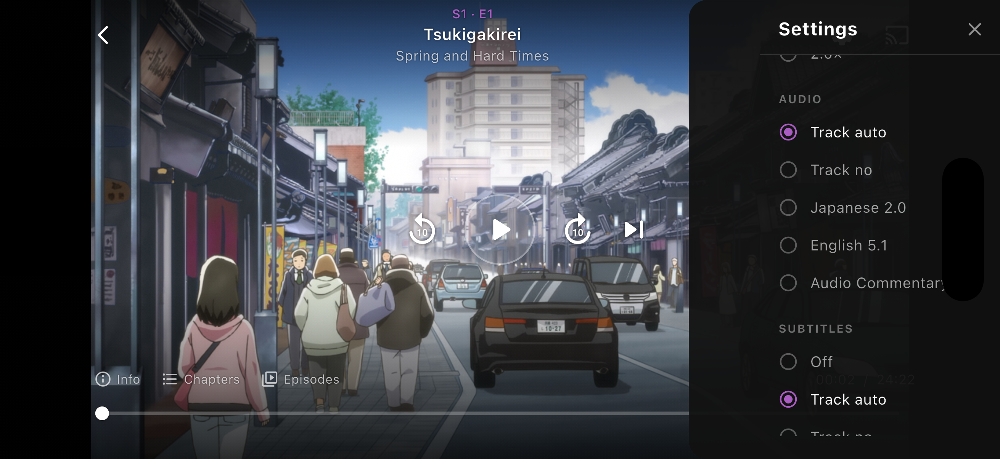

### Settings Subtitle Select

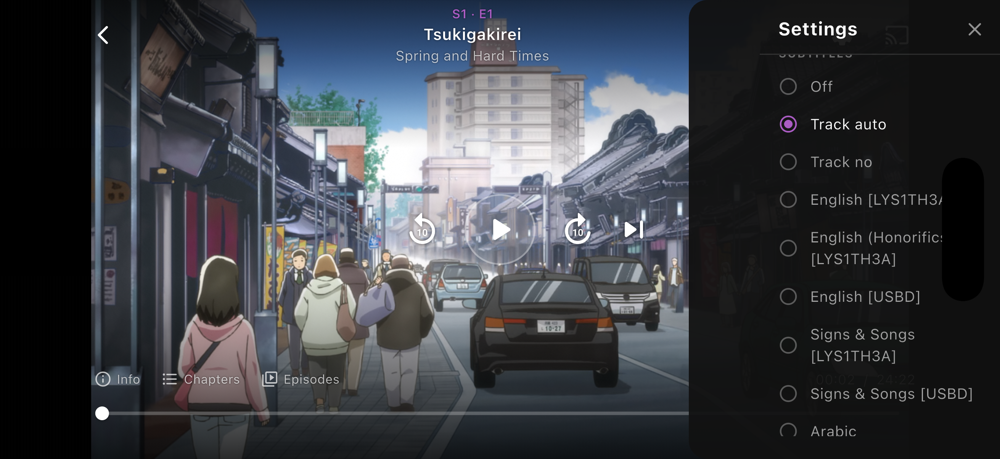

### Chapter Panel

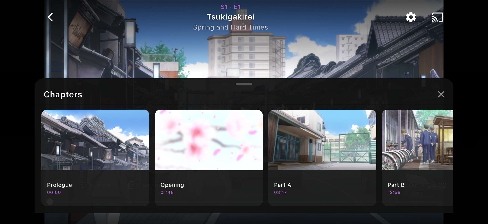

### Episode Select Panel

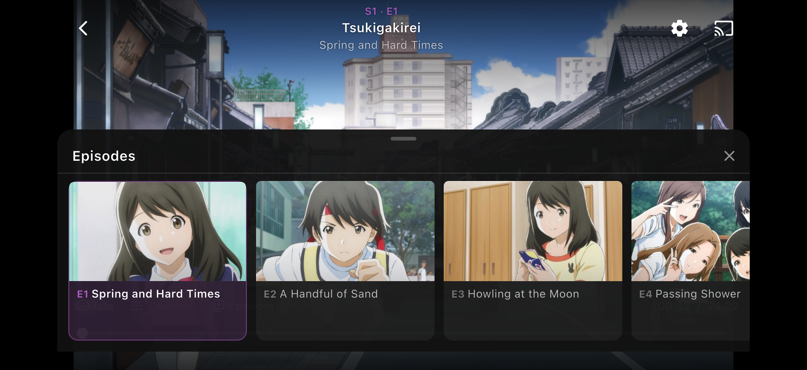

### Info Panel

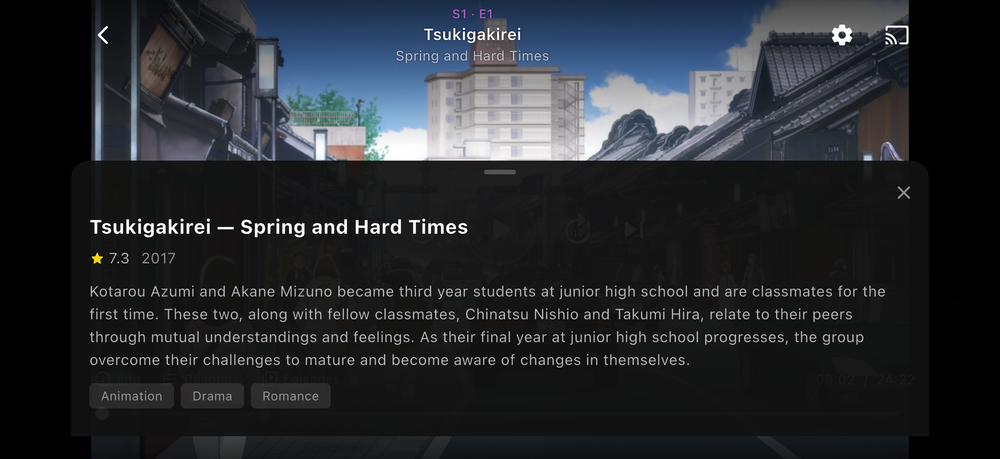
